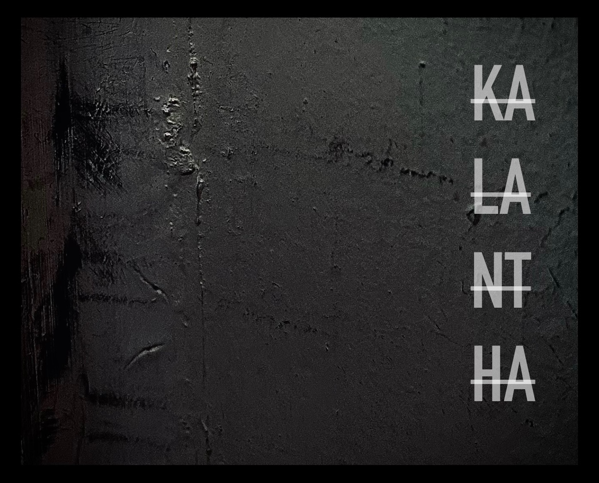

# kalantha
A collection of header-only freestanding C++ utilities with zero dependencies.

## License
This project is governed under the BSD 3-Clause "New" or "Revised" License.
For more information, view the LICENSE file found at the root of this project's source tree.
